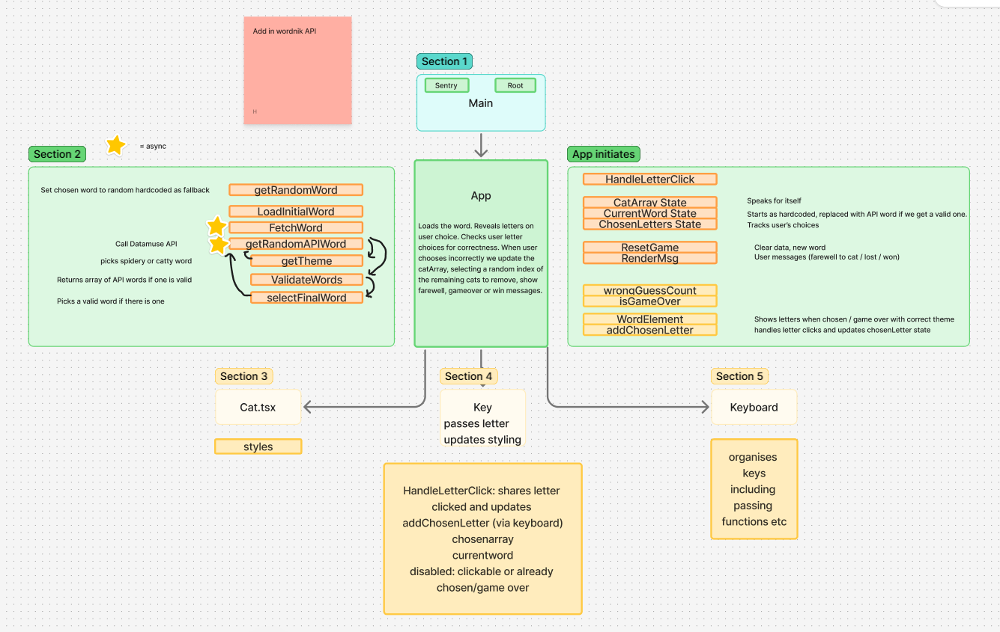
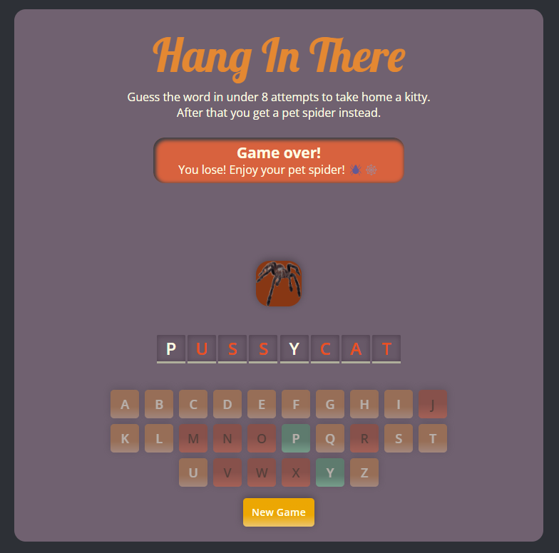

# $${\color{orange}Hang}$$ $${\color{orange}In}$$ $${\color{orange}There}$$


## A Hangman Game - with cats.🐈

[Overview](#overview)\
[Requirements](#requirements)\
[The Process](#the-process)\
[Built With](#built-with)\
[Key Skills](#key-skills-employed)\
[Continued Development](#continued-development)\
[Screenshots](#screenshots)\
[Classic](#classic)


## Overview
The aim is to solve the word puzzle (themed around cats and spiders) and make your choice from the remaining cats, before the only pet remaining is a spider (8 moves).
With unlimited resources I'd like to have the cats hanging as in the notorious posters and falling when you guess incorrectly - in case anyone was wondering about the name!
Based on the final Capstone project in Scrimba's Learn React Course.




## Requirements

The app fetches words from an API so is best when connected to the internet but it does have a fallback wordlist for offline use.

- Node,js
- Npm
- A modern browser (I'm using Chrome)

To install dependencies:
```
npm install
```

To start the development server:
```
npm run dev
```

When ready to build for production:
```
npm run build
```
N.B
Note that in development, React Strict Mode causes certain lifecycle methods and hooks (like useEffect) to run twice to help identify side effects.

## The Process
- I tried to keep the file structure simple with this project to grow my understanding of the React/Vite set up.
- The design was part of my personal challenge, to use whatever colour scheme is first randomly generated by https://coolors.co/ - especially challenging when trying to keep red for wrong and green for correct!
- Decided to prevent the array of cats realigning when a cat is removed following an incorrect answer, hoping to make it clearer which cat was lost and foster some level of attachment in the user.
- I really struggled to find a free API with sufficient parameters like flexible length, British English spelling and reading level option. The API results are currently more suited to a young hearted adult player rather than the younger age range I had initially envisioned.
**update** 4/25 - on again off again CORS issues with Datamuse API, so Ive added a more reliable API, Wordnik, leaving Datamuse as a first fallback.
**update** 3/25 - It looks like the original API site has been retired. As a part of getting the app working again I had a little revamp due to the constraints of the temporary API. Each new call to the API returns words related by theme. We should have the majority of words vaguely cat or spider related! 
- Revisiting the project ocassionally after learning a new skill - for example I switched from JS to TS and added Sentry for practice!
- I've updated to include a more responsive design for mobile devices.

## Built With

REACT - VITE - TS - TSX - HTML - CSS - SENTRY

**APIs**
~~https://random-word-api.herokuapp.com~~ (sadly retired March 2025 😢)\
**Current APIs:**[Wordnik API](https://developer.wordnik.com primary word source,\
[Datamuse API](https://api.datamuse.com) (now serving up cat and spider themed words! 🐱🕷️)

## Key Skills Employed

- Iteratively planning before coding.
- Prop Drilling and controlling state.
- Understanding file structure.
- It was fascinating to learn a little more about accessibility (aria-labels, aria-live, and "sr-only" sections). I'll have to look more into this, as well as learning about contrasting colours.

## Continued Development

Completed:
✔️ Linking to an API to pull word lists in. 
✔️ Implement responsive design.
✔️ Convert to TypeScript.
✔️ Add error tracking.

To Do:
- Add new word option during gameplay.
- Add turn counter for spider warning.
- Enhance animations and transitions.
- Add sound effects.
- Implement Context API if complexity increases.
- Optimize folder structure.

## Screenshots

Farewell message and key styling on negative guess.\


Green successful guess buttons.\


Win\


  ## Author
  @Holl4444\
  Based on Scrimba's final Capstone project in the Learn React Course. 

  ### Classic

  
